# ⚔ DualMind IDE

> **Multiple AI agents debate every line of code. One verdict. The best code wins.**

DualMind IDE is a full-stack, AI-first code editor where multiple AI agents argue with each other to produce the best possible code — then a **Judge** synthesizes the final result. Built on Monaco Editor (the engine powering VS Code), with a real Node.js backend.


---

## ✨ Features

### 🤖 AI Debate Engine — Unlimited Agents
Every AI interaction is a structured multi-agent debate:
1. **Debaters** (any number) each argue their approach in turn
2. **Judge** (the last agent) synthesizes the final, optimal solution

Add as many agents as you want — give each a different provider for maximum diversity!

### 5 Debate Modes
| Mode | Description |
|------|-------------|
| ⚡ **Quick Code** | Generate any code snippet via multi-round debate |
| 🏗️ **Build App** | Describe an app → Planner designs file structure → debate generates each file |
| 💡 **Explain** | Paste code → agents explain from their unique perspectives |
| 🔧 **Refactor** | Adversarial refactoring → result applied directly to editor |
| 🐛 **Fix Bug** | Paste code + error → adversarial debugging → best fix wins |

### 🔌 10 AI Providers — Mix & Match Per Agent
Each agent can use a **different AI provider**:

| Provider | Highlights |
|----------|-----------|
| **Google Gemini** | Gemini 2.5 Pro, 2.0 Flash, 1.5 Pro |
| **OpenAI** | GPT-4o, o1-mini, o3-mini (reasoning) |
| **Anthropic Claude** | Claude 3.7 Sonnet ✨, 3.5 Sonnet/Haiku |
| **Groq** ⚡ Free | Llama 3.3 70B, DeepSeek R1, Qwen QwQ 32B |
| **OpenRouter** | 200+ models via a single key |
| **Mistral AI** | Mistral Large, Codestral (code-specialist) |
| **DeepSeek** | DeepSeek V3, R1 (reasoning) |
| **xAI Grok** | Grok 2, Grok 2 Vision |
| **Cohere** | Command R+, Command R |
| **Ollama** 🏠 Local | Run Llama / DeepSeek / Mistral with no API key |

> Example: Agent 1 = GPT-4o, Agent 2 = Claude 3.7, Judge = Gemini 2.5 Pro

### 🖥️ Real IDE Features
- **Monaco Editor** — the actual VS Code engine, with syntax highlighting
- **VSCode Material Icons** — 40+ file-type icons (JS, TS, PY, MD, JSON, locks, gitignore…)
- **Multi-tab editing** with unsaved indicators
- **File Explorer** — browse, create, rename, delete files on your actual filesystem
- **Terminal** — Fully interactive PTY terminal backed by xterm.js (supports running servers, git interactive commands, etc.)
- **Git Panel** — see changed files and current branch
- **30+ language selectors** for debate modes (JS, TS, Python, Go, Rust, C++, SQL, SCSS…)
- **20+ tech stacks** for App Builder (Next.js, NestJS, FastAPI, Django, Tauri, Electron…)
- **Ctrl+S** saves directly to disk
- **VSCode Dark+** theme throughout

---

## 📸 Screenshots

> All screenshots taken from DualMind IDE running locally at `http://localhost:5173`

### 🖥️ Main IDE Interface

*The full IDE layout — File Explorer (left), Monaco Editor (center), Debate Panel (right), Terminal (bottom)*

---

### ⚡ Debate In Action — Powered by Groq (Free & Fast)

A real AI battle using **Groq's Llama 3.3 70B** for all 3 agents (Archie + Optix debate → Judge synthesizes):

**1. Settings configured — Groq + Llama 3.3 70B for all agents**
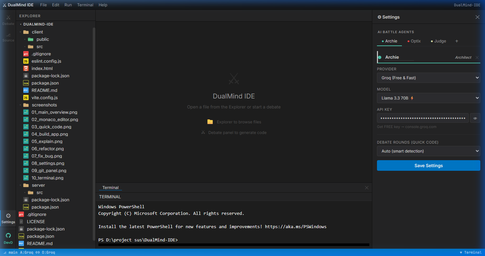
*All 3 agents (Archie, Optix, Judge) set to Groq's Llama 3.3 70B — completely free*

**2. Prompt entered — "Write a Python prime-checking function"**
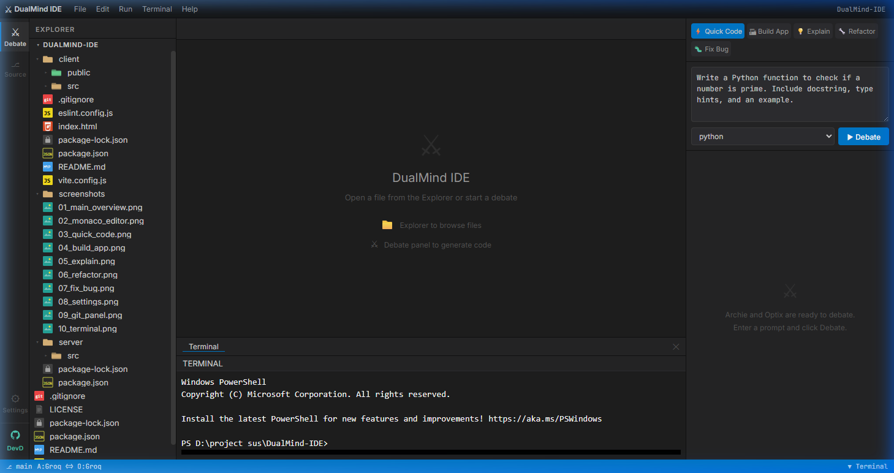
*Python language selected, prompt ready — the full IDE project is visible in the Explorer*

**3. Live debate — Agents arguing, Judge preparing verdict**
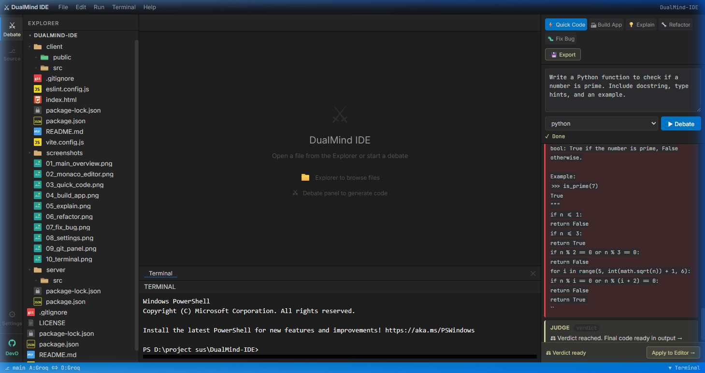
*Debate completed in under 5 seconds via Groq! The Judge's optimized O(√n) prime checker is visible*

**4. Final verdict — Judge synthesized the best solution**

*"Verdict reached. Final code ready in output →" — click **Apply to Editor** to insert the winning code*

---

### 📝 Monaco Editor with File Explorer
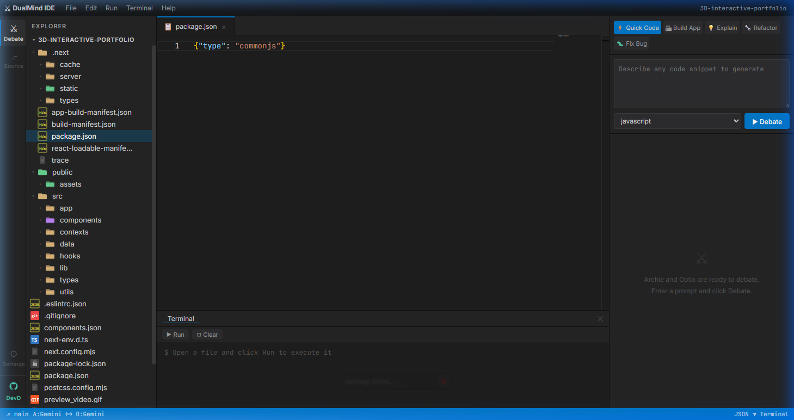
*VS Code-quality Monaco Editor with VSCode Material file icons, multi-tab support, and syntax highlighting*

---

### 🤖 AI Debate Modes

**⚡ Quick Code** — Describe any code snippet and let agents debate the best approach
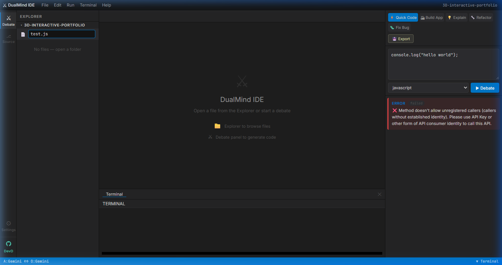

**🏗️ Build App** — Describe an app, get a full multi-file project generated via debate
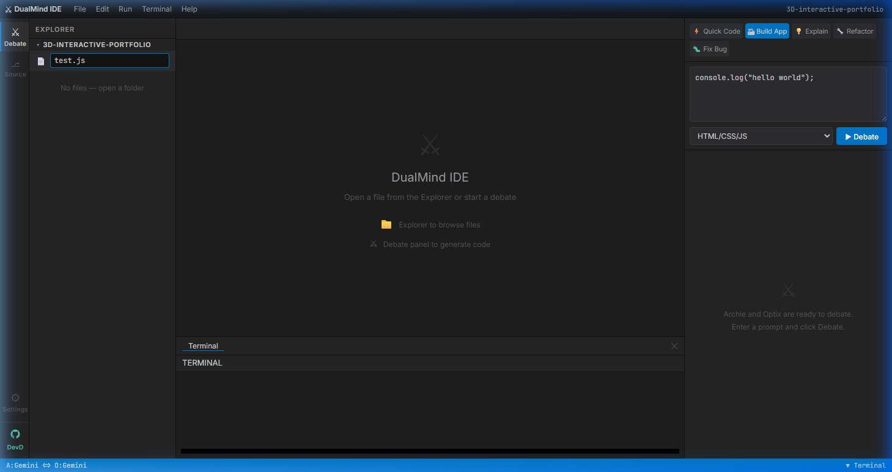

**💡 Explain** — Paste code and agents explain it from their unique perspectives
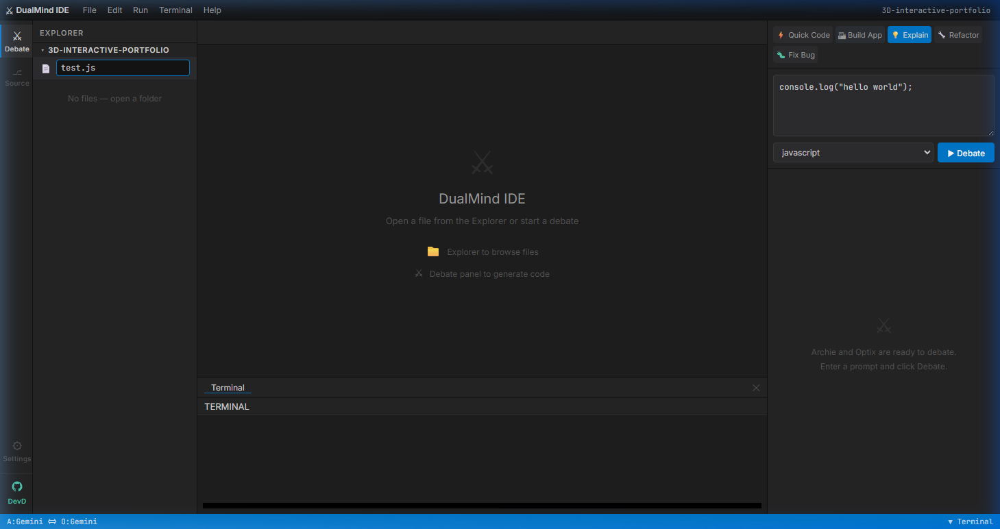

**🔧 Refactor** — Adversarial refactoring that applies the winning solution directly to your editor
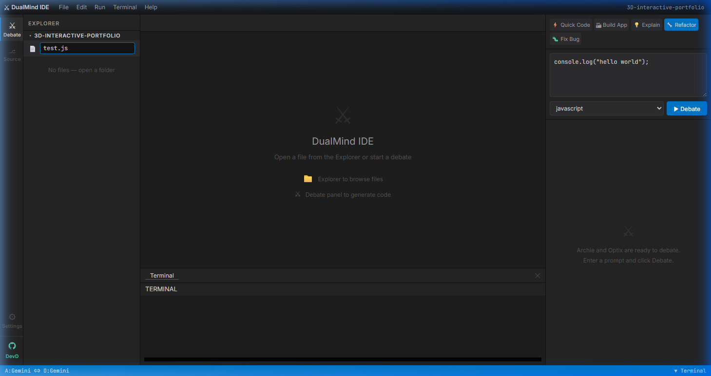

**🐛 Fix Bug** — Paste code + error → agents debate the best fix → winner is applied
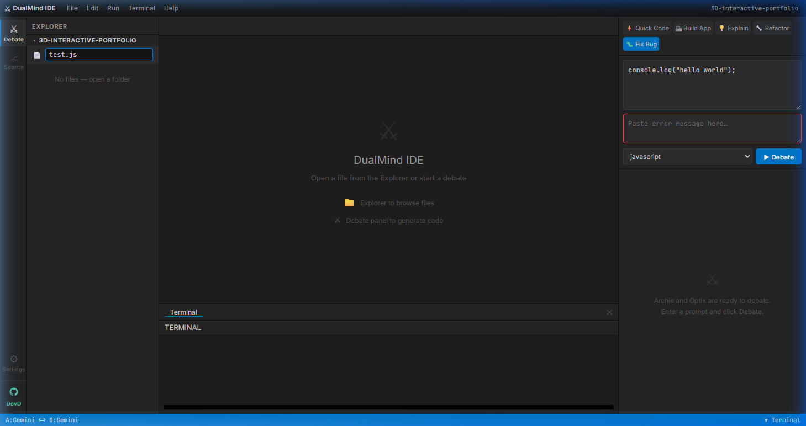

---

### ⚙️ Settings — AI Battle Agent Configuration
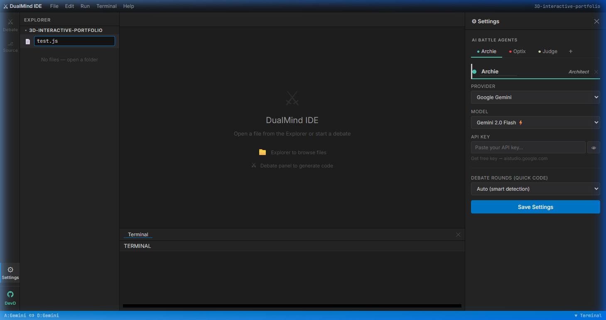
*Add unlimited agents (Archie, Optix, Judge…), choose provider (Gemini, OpenAI, Claude, Groq, Ollama…), model, and API key per agent*

---

### 🔗 Git & DevD Panel
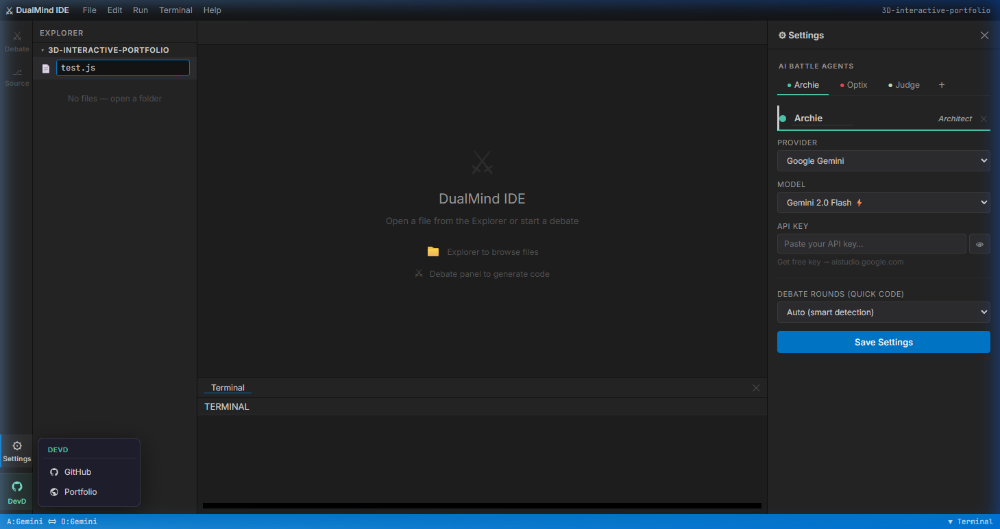
*Quick access links including GitHub profile and Portfolio — shown via the DevD panel in the Activity Bar*

---

### 💻 Integrated Terminal
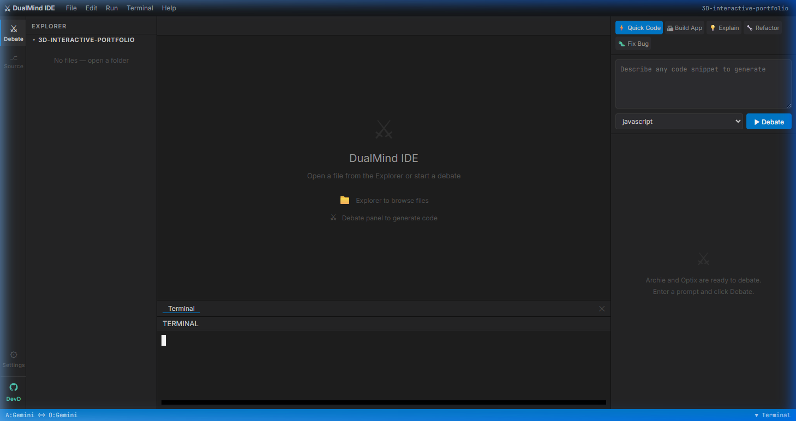
*Built-in Terminal panel for running commands directly inside the IDE*

---

## 🏗️ Architecture

```
DualMind-IDE/
├── client/                  ← React 18 + Vite + Monaco Editor
│   └── src/
│       ├── components/
│       │   ├── Layout/      (Shell, ActivityBar, MenuBar, StatusBar)
│       │   ├── Editor/      (Monaco + Tabs)
│       │   ├── FileExplorer/ ← VSCode Material SVG icons
│       │   ├── Debate/      (DebatePanel, Messages, BuildOutput)
│       │   ├── Terminal/
│       │   ├── Git/
│       │   └── Settings/    ← Dynamic agent management
│       ├── services/
│       │   ├── ai.js        ← 10-provider abstraction (50+ models)
│       │   ├── debate.js    ← N-agent debate orchestrators
│       │   └── backend.js   ← axios API client
│       └── store/           ← Zustand global state
└── server/                  ← Node.js + Express + Socket.io
    └── src/
        ├── routes/
        │   ├── files.js     ← CRUD file operations
        │   ├── execute.js   ← run code, stream via WebSocket
        │   └── git.js       ← git status/diff
        └── index.js
```

---

## 🚀 Getting Started

### Prerequisites
- Node.js 18+
- npm 9+
- **Docker Desktop** (Required for the code execution sandbox)
- At least one AI API key (Groq is free → [console.groq.com](https://console.groq.com))
  OR run [Ollama](https://ollama.ai) locally for completely free local inference.

> **OS Support:** DualMind IDE is entirely web-based and cross-platform. It runs flawlessly on **Windows, macOS, and Linux**. The native "Open Folder" picker automatically detects your OS and launches the correct native dialog (`FolderBrowserDialog`, `osascript`, or `zenity`/`kdialog`).

### Installation

```bash
# Clone the repo
git clone https://github.com/DevD-bot/DualMind-IDE.git
cd DualMind-IDE

# Install all dependencies (root + server + client)
npm run install:all
```

### Running

```bash
# Start both client and server simultaneously
npm run dev
```

Then open:
- **IDE:** `http://localhost:5173`
- **API:** `http://localhost:3001`

Or run separately:
```bash
npm run dev:server   # Node.js backend on port 3001
npm run dev:client   # React frontend on port 5173
```

### First-Time Setup

1. Open `http://localhost:5173`
2. Enter a workspace folder path (e.g. `C:\projects\myapp`)
3. Click the **⚙ Settings** icon in the activity bar
4. Configure your agents — add more with **＋**, remove with **✕**, rename them freely
5. Set each agent's provider, model, and API key
6. Switch to the **⚔ Debate panel** and start debating!

---

## 🔑 Getting API Keys

| Provider | Free tier | Link |
|----------|-----------|------|
| Google Gemini | ✅ Yes | [aistudio.google.com](https://aistudio.google.com) |
| OpenAI | ❌ Paid | [platform.openai.com](https://platform.openai.com) |
| Anthropic | ❌ Paid | [console.anthropic.com](https://console.anthropic.com) |
| **Groq** | ✅ **Free** | [console.groq.com](https://console.groq.com) |
| OpenRouter | ✅ Some free | [openrouter.ai](https://openrouter.ai) |
| Mistral | ✅ Trial credits | [console.mistral.ai](https://console.mistral.ai) |
| DeepSeek | ✅ Very cheap | [platform.deepseek.com](https://platform.deepseek.com) |
| xAI Grok | ✅ Trial credits | [console.x.ai](https://console.x.ai) |
| Cohere | ✅ Trial credits | [dashboard.cohere.com](https://dashboard.cohere.com) |
| **Ollama** | ✅ **Free/Local** | [ollama.ai](https://ollama.ai) |

> **Tip:** Use Groq for all agents to get started for free with Llama 3.3 70B or DeepSeek R1.

---

## 🛠️ Tech Stack

| Layer | Tech |
|-------|------|
| Frontend | React 18 + Vite |
| Code Editor | `@monaco-editor/react` (VS Code engine) |
| State | Zustand |
| Backend | Node.js + Express |
| Real-time | Socket.io (terminal streaming) |
| HTTP client | Axios |
| Styling | Vanilla CSS (VSCode Dark+ theme) |
| Code execution | child_process sandbox |

---

## 📋 Roadmap

- [x] LSP integration (autocomplete, go-to-definition)
- [x] Real-time collaboration (Yjs/CRDT)
- [x] Docker sandbox for code execution
- [x] Git commit/stage/push UI
- [x] Debate history export
- [x] Custom agent names & personas
- [x] Ollama (self-hosted LLM) support
- [x] VSCode Material file icons
- [x] 10 AI provider support

---

## 🤝 Contributing

Pull requests are welcome! For major changes, please open an issue first.

1. Fork the repo
2. Create a feature branch (`git checkout -b feature/amazing-feature`)
3. Commit your changes (`git commit -m 'feat: add amazing feature'`)
4. Push to the branch (`git push origin feature/amazing-feature`)
5. Open a Pull Request

---

## 📄 License

Business Source License 1.1 (BUSL-1.1) — see [LICENSE](LICENSE) for details.
- **Non-commercial use:** Allowed.
- **Commercial use:** Restricted until 2028-01-01, after which it converts to MIT.

---

<div align="center">
  <strong>Crafted with code & caffeine ☕ — by a Dev for the world.</strong>
</div>
